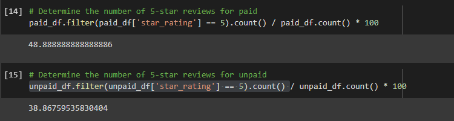

# Amazon Vine Analysis

## **Overview of Analysis:**
The purpose of this project was to use Amazon's AWS and S3 bucket systems to extract, transform, and load user ratings data. Google Colab and Pyspark were then used to visualize the raw data and to make analysis based on those DataFrames. 

## **Results:**
The bucket used for this analysis was ratings on video games and can be broken down as the following: 

### 1. The total votes for the paid ("vine") subscriptions and the unpaid subscriptions 
 

 

There are significantly more unpaid votes as opposed to paid votes according to these results. 
  

### 2. The number of paid Vine reviews that have 5 stars vs the number of unpaid Vine reviews with five stars

 

There are a significant more amount of people giving five-star reviews as an unpaid user as opposed to a paid user. 
  

## 3. The percent of paid Vine reviews that have 5 stars vs the percent of unpaid Vine reviews with five stars

 

The fact that the percentage of the paid five-star reviews is higher(48.8%) than the unpaid percent (38.8%) suggests that the paid users are more likely to give a good review of a video game as opposed to an unpaid user. 

  

## **Summary:**

The conclusion is that there is a possibility of bias in the paid vs. unpaid subscriptions. It is possible that an unpaid user is more likely to judge a game more harshly than paid users. This might be because they have a throw-away account and are more inclined to be negative in a review for various reasons. This happens a lot, especially in the video game community, where an anonymous user can be quite harsh in a review but spend several hours playing the game. Paid users are probably more inclined to be less harshly critical. This could possibly be since their reviews add up to suggested games and they want to find similar, if not better titles to the one's they've played. 
 
There can be additional analysis done on the number of games played by each type of user and the time spent playing them. Unpaid gamers could be more likely to switch between games before realizing that they like them as opposed to paid users who could be investing more time into the game.
